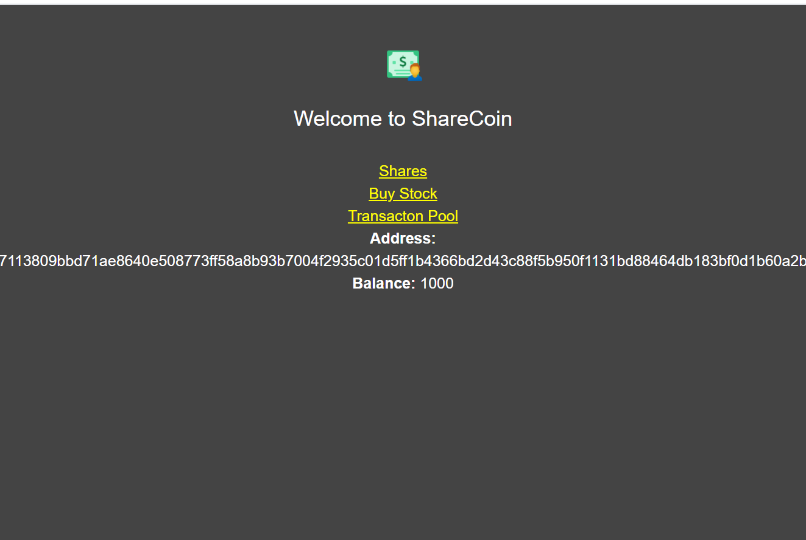
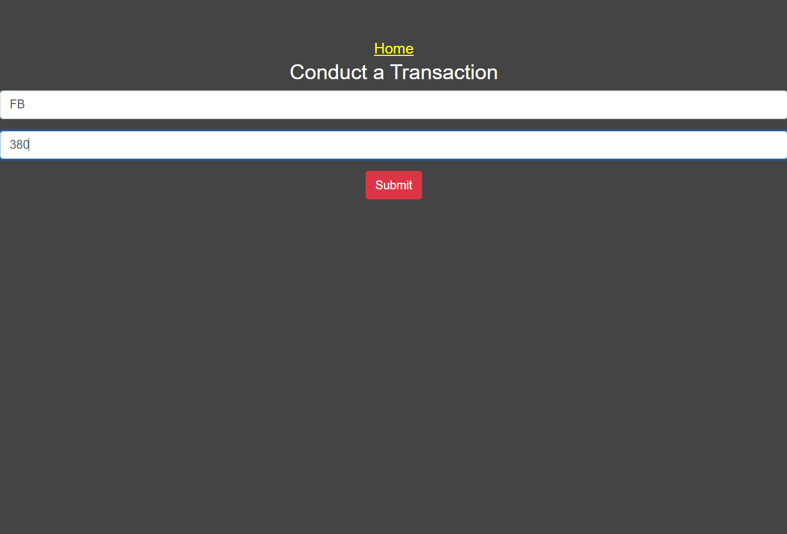
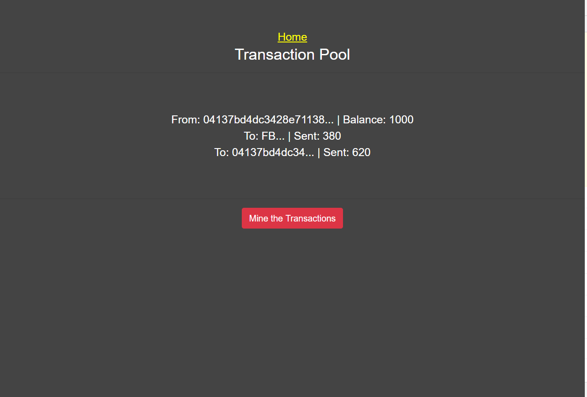
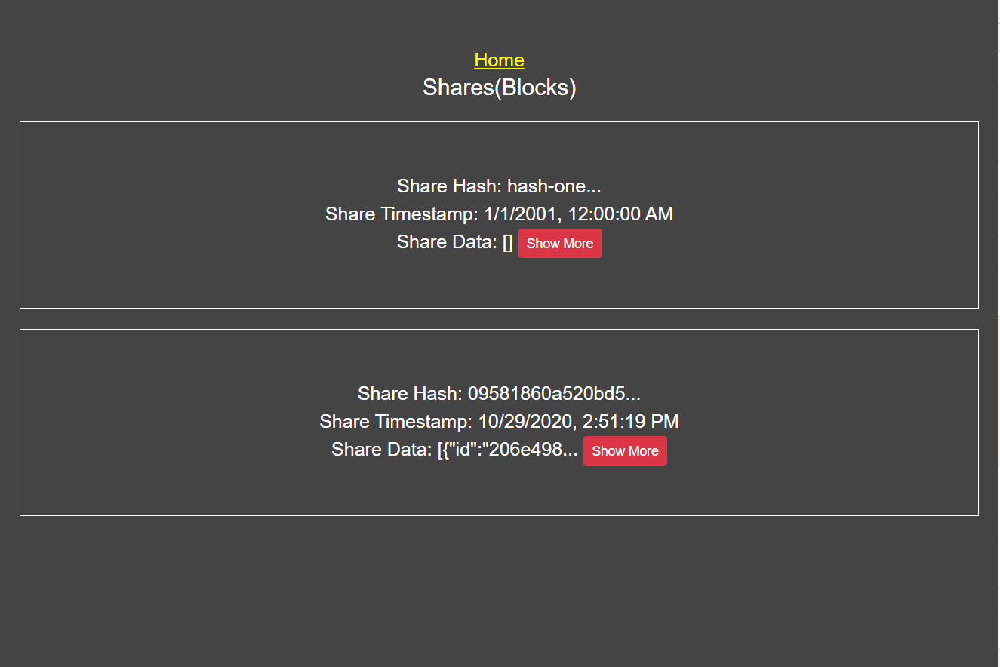
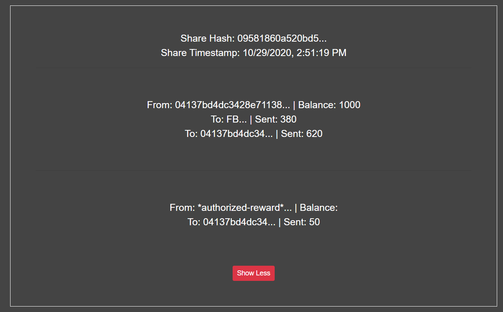

# ShareCoin Blockchain 

A simple stock buying blockchain App that uses Redis for caching the blocks of transactions in the blockchain.


<h2 id="screenshots">Screenshots</h2>









<h2 id="development">Development</h2>

This app is built with the Node v10.15.3 and React v16.13.1. Once you have the [Node/NPM CLI installed](https://nodejs.org/en/), start by cloning the repo:

```
$ git clone https://github.com/emodatt08/ShareCoin-Blockchain-and-Cryptocurrency.git
$ cd <project name>
```

From there you can use the `install` command to install the dependencies of the project:

```
$ npm install
```
Install redis and run it(On Windows, you can install the embedded Ubuntu system and install redis)[Redis CLI](https://github.com/redis/redis):
```
$  redis-server --daemonize yes
```

then use `run dev` command to run the project on your web browser in dev mode:
$ npm run dev 
```


